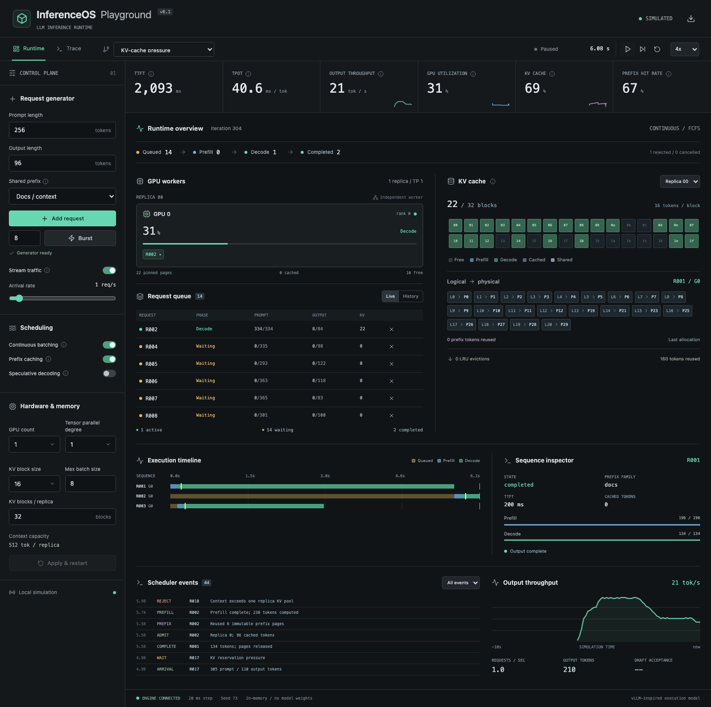

# InferenceOS Playground v0.2

A local LLM serving experiment platform: freeze a workload, compare runtime strategies, and inspect why execution changed. All results are **SIMULATED**. No API key, GPU, backend, model download or cloud service is required.



## Run

Requires Node.js 22+ and npm.

```bash
cd inferenceos-playground
npm ci
npm run dev -- --port 5178
```

Open http://127.0.0.1:5178. To serve the production bundle: `npm run build` then `npm run preview -- --port 5179`.

## Verify

```bash
npx playwright install chromium
npm run verify
```

`verify` runs unit/stress tests, TypeScript + production build, then Chromium E2E. Individual commands: `npm test`, `npm run build`, `npm run test:e2e`. E2E launches or reuses port 5178 and saves screenshots in `artifacts/`. GitHub Actions runs on `main`, `feat/**`, pull requests and manual dispatch.

## Workspaces

- **Runtime:** preserve the v0.1 queue, paged KV view, worker topology, timeline, live feature switches, request cancellation, traffic controls and trace export. Add token/chunk budgets, priority/aging, RECOMPUTE preemption, hash lookup inspection and TP stage timing.
- **Compare:** Static → Continuous → +Prefix → +Spec. Generate one immutable workload with fixed arrival times, lengths, token identities, priorities and seed. Every run consumes that exact trace. Separate modes compare FCFS/Priority or TP1/2/4/8.
- **Trace:** inspect recent execution spans, events, requests and telemetry. Expert mode exposes scheduler, prefix-chain and communication inspectors. Beginner mode uses the same engine with fewer controls.

Workload Builder supports uniform, burst, Poisson-like, prefix-heavy, long-context and mixed traffic; fixed/uniform/bimodal lengths; prefix reuse; long-context ratio; burstiness. Field edits take effect on **Generate workload**. The displayed fingerprint identifies the frozen trace; it is a checksum, not a cryptographic guarantee.

Comparison includes a metric matrix, selectable baseline, percentage deltas, five shared-time-axis charts, deterministic **Explain Why**, and JSON/Markdown reports. A zero or missing baseline yields `Δ n/a`. JSON includes the entire workload, per-strategy configuration, received identities, metrics, deltas, time series, scheduler/cache/preemption/TP statistics and model assumptions.

## Architecture

Simulation code has no React dependency. The original engine and cache allocator are extended, not replaced.

| File | Responsibility |
| --- | --- |
| `src/simulation/engine.ts` | Fixed 20 ms clock, admission, lifecycle, batch service, recompute and invariants |
| `scheduler.ts` | Pure per-replica token allocation, decode-first rotation, chunk limits, effective priority |
| `cache.ts` | Chained block hashes, exact identity checks, references, reservations, incremental pages and unpinned LRU |
| `workload.ts` | Seeded generation, validation, deep freezing, trace fingerprint |
| `comparison.ts` | Synchronized replay, per-strategy completion and metrics, fairness assertions |
| `communication.ts` | Attention → AllReduce → MLP → AllReduce duration and stage integration |
| `metrics.ts`, `report.ts` | Lifetime/window metrics, deterministic explanations and exports |
| `types.ts`, `scenarios.ts` | Contracts and 15 mechanism-specific scenarios |
| `src/components/` | Existing profiler views, CompareLab and focused inspectors |

Runtime displays at 25 Hz; comparison advances fixed simulation steps in batches and displays at 10 Hz. Hidden workspaces pause their clocks. Memoization avoids rebuilding frozen identity checksums and rerendering hidden Compare from Runtime updates.

## Serving mechanisms and teaching simplifications

**Scheduling:** each replica has a token budget and maximum sequence count. Decode/verification positions consume budget first; remaining positions go to bounded prefill chunks. Decode and prefill can coexist in one iteration. Small budgets rotate within each phase. Static mode drains a cohort; continuous mode admits at free batch boundaries. FCFS bypasses infeasible requests; Priority sorts admission by base priority plus one level per two seconds of accumulated waiting.

**Preemption:** Priority + preemption may evict lower-effective-priority requests only when doing so permits admission. Victims must have resided for 200 ms and may be preempted at most three times. Preemption waits for the replica batch boundary, releases KV ownership, preserves emitted output, and re-prefills prompt + generated context. There is no swap. Recomputed tokens and sequence service time are explicit costs.

**Memory:** conservative admission reserves the entire declared prompt + output capacity. Physical allocation remains incremental. Invariant: pinned pages + unallocated reserved pages ≤ capacity. Oversized contexts are rejected. Queue cap is 256. Prefix pages without owners remain available until LRU eviction.

**Prefix cache:** `chat`, `code`, `docs` synthesize shared token identities for up to 128 tokens / half the prompt. Underneath, each full block hashes `(parent hash, token identities)`; exact content checks guard hash collisions. Lookup stops at the first miss. Only full immutable prompt pages are published; mutable tails never share. Explicit token identities can describe longer shared prefixes. Cache is local to each replica.

**TP:** compute per replica is divided by TP degree. A synthetic 32-layer, width-4096 FP16 model adds two ring AllReduces per layer:

```text
verification factor = 1 + 0.65 × (mean decode positions per sequence − 1) / 4
compute ms = [0.03 × prefill positions + decode cost × verification factor] / TP
decode cost = 36 + context / 128 + 2 × decoding sequences
activation bytes = scheduled positions × 4096 × 2 × 32
bytes / collective / rank = 2 × (TP−1) / TP × activation bytes
collective ms = bytes / (GB/s × 10⁶) + 2 × (TP−1) × 32 × latency µs / 1000
```

TP1 has no communication. PCIe defaults to illustrative 32 GB/s / 50 µs; NVLink to 300 GB/s / 5 µs; Custom is editable. Communication delays actual completion. Rank batches are synchronized; compute/communication stats sum replica service once, not once per rank. Collective volume sums transmitted bytes across ranks. There is no compute/communication overlap.

**TP scaling** uses one replica in each run and the same KV token capacity, with 1/2/4/8 GPUs respectively. This varies hardware budget; it is not an equal-cost comparison. More ranks can be slower because communication grows.

**Speculation:** verify up to four drafts plus one correction/bonus, bounded by available budget/output. Each draft position accepts with probability .76 using deterministic request/output-position randomness, separate from traffic generation. Rejected draft positions still cost budget. Draft model memory and temporary verification KV are omitted.

The verification factor interpolates from 1× for one position (no drafts) to 1.65× for five. Communication prices the actual allocated positions. Decode context cost considers scheduled decoders only. Round-robin cursors advance by service decisions, independent of multi-tick batch duration.

All timing constants and utilization values are synthetic educational assumptions. They do **not** predict H100/A100 performance. Single-seed deltas describe the model, with no statistical significance or isolated causal claim.

## Metrics

| Metric | Definition |
| --- | --- |
| TTFT | Mean arrival-to-first-output time among requests that emitted, including queue delay |
| TPOT | Post-first-output elapsed time / post-first-output token count; same-burst spacing is zero |
| Runtime throughput | Output/completions in the trailing 1 s; startup uses elapsed time |
| Compare throughput / Req/s | Lifetime output/completions divided by that strategy's own elapsed time from zero to drain |
| Queue Time | Total initial + preemption waiting across admissions / distinct admitted requests |
| GPU Util | Synthetic phase/batch occupancy averaged over time in Compare; no hardware telemetry |
| KV Util | Occupied pages including retained prefix cache / physical pages; time average in Compare |
| Prefix Hit | Lookups reusing at least one full page / eligible lookups with caching enabled |
| Recompute service | Summed service duration for recomputing sequences; sequence-ms, not critical-path delay |
| Compute / Communication | Integrated executed stage durations summed across replicas |

Counters survive display-history pruning. Cancelled requests that emitted still contribute to latency. Completed/rejected/cancelled are separate. Inspect rejected counts before interpreting comparisons. Charts share a common clock; finished strategies show idle after completion while their final summary stays fixed.

## Three-minute demo

1. **0:00–0:40 · Static vs Continuous:** Compare → Generate workload → Run comparison. Inspect throughput and queue curves, change the baseline, click TTFT for trace-derived observations.
2. **0:40–1:15 · Chunked Prefill:** Runtime → Chunked Prefill → Expert. Pause and step; inspect successive 512-token chunks mixed with decode in Scheduler Inspector.
3. **1:15–1:45 · Prefix cache:** Shared system prompt scenario. Select a later request, click hash blocks; follow HITs until the unique suffix causes a MISS.
4. **1:45–2:25 · TP scaling:** Compare → TP scaling. Run on NVLink, then Custom with low bandwidth/high latency. Inspect the compute/communication split and throughput.
5. **2:25–3:00 · Preemption:** Runtime → Preemption pressure. At 400 ms a HIGH request arrives; observe PREEMPTED → RECOMPUTE → RUNNING, released pages and rebuilt token counts.

## Limits

- No real model, tokenizer, attention math, CUDA, distributed transport, beam search, swap or persistent sessions.
- Fixed 20 ms quantization; browser background throttling slows playback rather than changing simulation time.
- Conservative reservations and batch-boundary admission/preemption are deliberate simplifications.
- 1–8192 prompt / 1–1024 output tokens; 16–512 blocks per replica; 1–16 sequences; maximum 256 requests per experiment.
- Comparison stops at 120 simulated seconds and labels incomplete runs **TIME LIMIT / partial results**.
- Runtime keeps 160 terminal requests, 100 events, 180 chart samples, 240 replica iterations and 600 spans per request. Trace export is recent history + lifetime statistics. Comparison retains the full input workload and up to 1201 samples per strategy.
- Runs on the browser main thread; ordinary bounded experiments are the target, not production-scale load generation.
- Chromium is verified; other browser engines are not certified.
