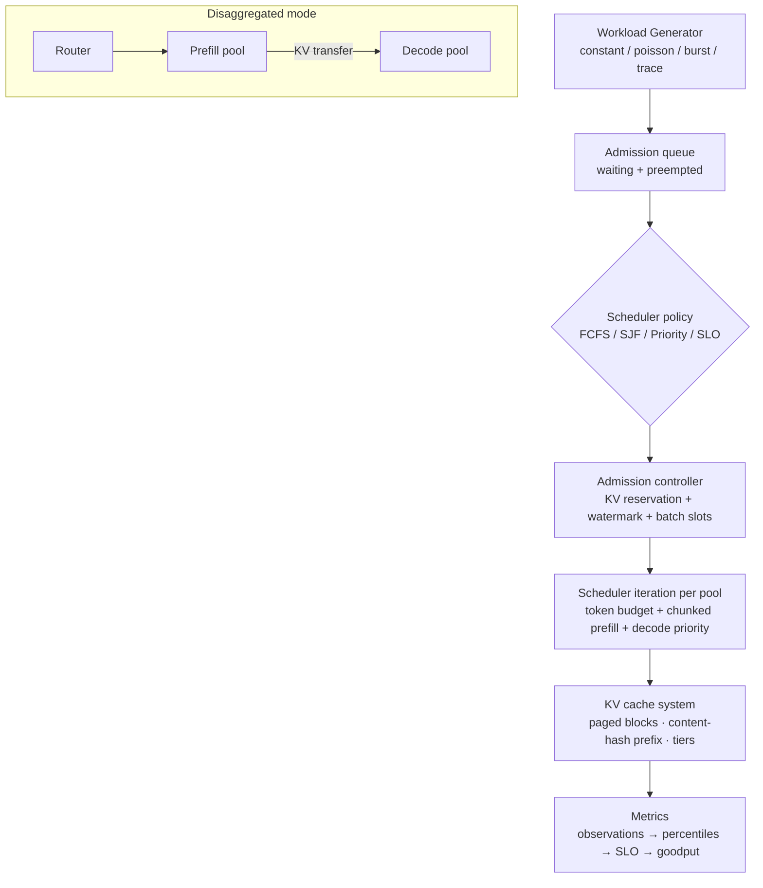

# Architecture

InferenceOS Lab is a **deterministic, fixed-step systems simulator** with a hard boundary: the simulation core (`src/simulation/`) is pure TypeScript with zero React or DOM dependencies. React only configures, displays, and collects user actions.

## System model

## Engine loop

One call to `SimulationEngine.step(count)` advances `count` scheduler iterations of 20 simulated milliseconds each. Per tick, in order:

1. **Traffic**: the workload generator emits arrivals (credit accumulator for constant rate, exponential inter-arrivals for Poisson, periodic bursts, or a scripted trace). Arrivals are dropped while ≥128 requests wait (documented backoff).
2. **Admission**: the scheduler orders every `waiting`/`preempted` request; the admission controller walks them in that order and attaches each to the first pool that satisfies all of: conservative KV reservation (see [kv-cache.md](kv-cache.md)), KV watermark, free batch slot, static-cohort gating. Under `recompute` preemption a request that cannot fit may evict a strictly lower-ranked running request (see [scheduler.md](scheduler.md)). In disaggregated mode decode pools admit `decode_wait` requests here as well.
3. **Iteration per pool**: exactly one scheduler iteration per replica — decoding sequences claim the token budget (decode priority on) or prefill goes first (off); at most one prefill sequence advances a chunk of at most `prefillChunkSize` (or the whole remaining prompt when chunking is off), always bounded by the leftover budget. Token emissions, speculative draft/verify, prefix publication, and completions happen here.
4. **KV transfer** (disaggregated mode): the transfer manager starts queued transfers while under the concurrency cap, shares bandwidth equally among active transfers, and completes them when bytes are moved and the fixed latency has elapsed.
5. **Tier restores** (multi-tier KV): same mechanics, moving demoted prefix blocks back into the GPU pool.
6. **Observability**: worker snapshots, 100 ms chart samples, and display-history pruning (terminal requests are trimmed to the newest 160; the observations array keeps up to 4000 full per-request records).

## Determinism contract

- The engine owns a single seeded RNG (32-bit LCG, `src/simulation/rng.ts`) shared by the workload generator and speculation draws. No `Math.random()`, no `Date.now()`, no `performance.now()` anywhere in `src/simulation/`.
- All iteration order is either insertion order (requests), explicit stable sorts with `id` tie-breaks (schedulers), or request-id order (decode emission).
- Identical **seed + config + workload + action ordering** ⇒ byte-identical results — asserted by replay tests in the browser suite and by `node scripts/experiment.ts` (see [experiments.md](experiments.md)).

## Key invariants (enforced by `assertInvariants()` and the test suite)

- Pinned blocks ≤ pool capacity; pinned + unallocated reservations ≤ capacity.
- Every block owner references the block and vice versa; no leaked owners; no duplicate block inside one request's block table.
- Shared blocks are always immutable (published prefix blocks only); mutable tails never shared.
- `generated ≤ outputTokens`; `processed ≤ contextTokens` (prompt + generated).
- The per-iteration token budget is never exceeded (`decode + prefill ≤ maxNumBatchedTokens`).
- Disaggregated: a request decodes only after its KV transfer finished; cancelled requests leave the transfer pipeline; preempted requests hold no blocks.
- Terminal requests hold no blocks; workers schedule only active requests; no negative latencies or non-finite counters.

## Module map

| Module | Responsibility |
| --- | --- |
| `engine.ts` | fixed-step loop, admission, iterations, request lifecycle, invariants |
| `scheduler/*` | policy ordering + preemption rules (policies never touch resources) |
| `cache.ts` | physical blocks, content-hash prefix identity, LRU eviction, tier demotion/restores |
| `transfer.ts` | deterministic KV transfer / restore pipeline with bandwidth sharing |
| `workload.ts` | seeded arrivals and length/priority distributions |
| `metrics.ts` | per-request observations, nearest-rank percentiles, SLO, goodput |
| `experiment.ts` | versioned scenario files, headless runs, parameter sweeps, replay |
| `scenarios.ts` | the 22 teaching scenarios (each states what to observe) |

## Concurrency model

The engine runs on the browser main thread, one `step()` at a time from a 40 ms wall-clock interval scaled by the playback speed selector. Speed changes wall-clock pacing only, never the simulation clock. Workloads in this repository stay well within main-thread budget; the state is small and every hot loop is O(active requests + pool blocks).
