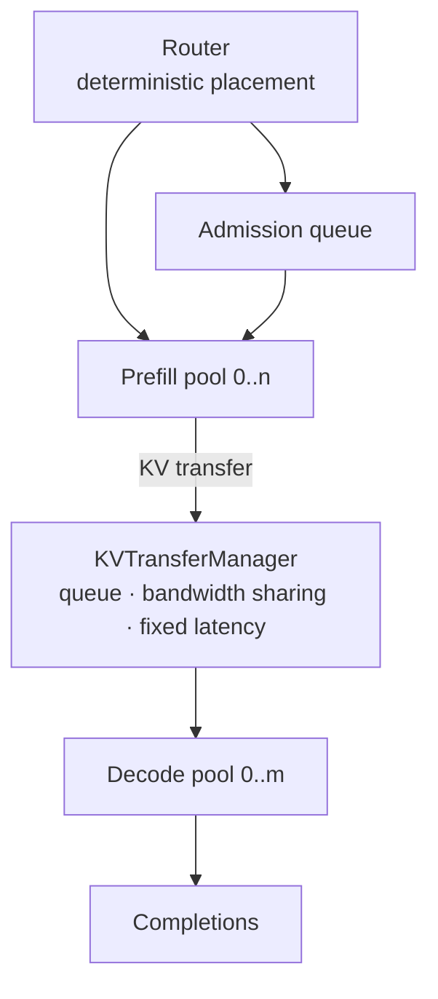

# Prefill / decode disaggregation

Monolithic serving runs prefill and decode on the same replicas; they interfere through the token budget and the batch. **Disaggregated serving** splits the two phases onto separate pools of GPUs and ships the KV between them. InferenceOS Lab models both topologies with the same deterministic engine.

## Topology



- `servingMode: 'disaggregated'` with `gpuCount` GPUs: `prefillGpuCount` (the primary knob — decode gets the rest), each side with its own TP degree (`prefillTP`, `decodeTP`). Pool count per side = GPUs / TP. The allocation is legal by construction (`decode = gpuCount − prefill`).
- Monolithic pools do both phases; disaggregated prefill pools only prefill, decode pools only decode — **interference by budget contention disappears by construction**, replaced by the transfer cost.

## Request lifecycle

```
waiting → prefill → transfer_wait → transferring → decode_wait → decode → completed
                  (KV on prefill pool)   (in flight)  (resident on       )
                                                          decode pool)
```

- The **router** assigns each waiting request to the least-loaded prefill pool (cache affinity breaks ties).
- When prefill completes, the engine picks the least-loaded decode pool, checks its usable capacity for the **full** prompt+output reservation, and enqueues a transfer (`transfer-queue` event). If no decode pool fits, the request waits in `transfer_wait` (reason: *Decode pool KV pressure*) and retries each tick — this is the P/D handoff bottleneck made visible.
- The transfer moves the prompt KV payload (`promptTokens × bytesPerToken`) over the modeled interconnect: active transfers **share the configured bandwidth equally** and each pays its fixed latency (`kvTransferLatencyUs`); up to `maxConcurrentTransfers` run at once. On completion the prefill-pool blocks are released (retained prefix cache stays) and fresh blocks are allocated on the decode pool (`decode_wait`).
- Decode admission admits `decode_wait` requests onto decode pools with the same batch/cohort rules as monolithic admission. **Decode never starts before its KV transfer finished** — invariant-tested.

## What the split changes

| Effect | Monolithic | Disaggregated |
| --- | --- | --- |
| Prefill/decode interference | Budget contention (chunking/decode-priority mitigate) | None within a pool — traded for transfer cost |
| TTFT | Queue + prefill | Queue + prefill **+ transfer queue + transfer** |
| P/D ratio mismatch | n/a | Prefill-poor ⇒ TTFT blowup; decode-poor ⇒ transfer staging backlog and TPOT pressure |
| Failure mode | ITL spikes during prefill | Queued transfers, backed-up prefill KV, idle decode GPUs |

## Transfer scheduling & backpressure

- `transferSchedulingPolicy` picks how concurrent transfers share the pipe: **fair-share** (equal split, FIFO start — the default), **fifo** (strict head-of-line service: the first transfer takes the whole pipe, others wait), **priority** (high-priority requests start first, then share equally). Metrics: `transferWaitP50/P99`, `networkUtilization` (pipe busy fraction), `networkBytes`.
- `maxPendingDecodeRequests` (0 = off) is the **backpressure** knob: when `transfer_wait + transferring + decode_wait` reaches the cap, prefill admission pauses (event `backpressure`, counters `backpressureEvents/backpressureTicks`) instead of producing un-transferable KV and wasting prefill compute. See the `decode-bottleneck-backpressure` scenario and compare with the limit disabled.

## Metrics

Per-request observations decompose the lifecycle: `prefillQueueLatency`, `prefillLatency`, `kvTransferQueueLatency` (prefill-done → transfer start: staging wait + queue), `kvTransferLatency` (in-flight), `decodeQueueLatency` (arrival on decode pool → decode admission). System metrics: prefill/decode GPU utilization separately, transfers done/active/queued, network bytes moved.

## What to observe

- `disaggregated-balanced` (4P+4D): transfer events between pools; both utilizations visible.
- `disaggregated-prefill-bottleneck` (2P+6D): the prefill pool queues, TTFT p99 blows up while decode GPUs idle.
- `disaggregated-decode-bottleneck` (6P+2D): prefill finishes fast but the small decode pool backs up transfer staging — decode capacity is the binding constraint.
- `network-bottleneck`: cut transfer bandwidth to 4 GB/s — transfers queue, TTFT p99 becomes transfer-dominated.
- Run Compare across 2P+6D / 4P+4D / 6P+2D at the same seed and workload. **Do not assume a winner: let the simulation decide** — the right P/D ratio depends on the workload shape, and the simulator will show which queue moves where.

## Not modeled

No RDMA/NCCL, no real network topology or congestion, no per-request routing policies beyond least-loaded, no overlap of transfer with compute beyond the pipeline stages above. The interconnect is a shared-bandwidth pipe with fixed per-transfer latency — an illustrative model, not a fabric simulation.
