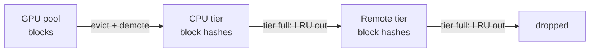

# KV cache design

The KV cache is the memory heart of the simulator. One logical pool per replica (`src/simulation/cache.ts`), sharded conceptually across TP ranks — the pool is the unit of scheduling and accounting.

## Paged blocks and block tables

- A pool owns `numBlocks` physical blocks of `blockSize` tokens each (config, restart-to-change).
- Every request holds a **block table**: logical block index → physical block id. Physical allocation is *incremental* — a request that has processed 100 of 512 prompt tokens owns only the blocks it needs, and two live sequences rarely own contiguous physical ranges (inspect any request in the Cache panel to see the mapping).
- Blocks fill to `used` tokens; a block is content-addressable only when full.

## Conservative reservation

Admission is **conservative**: a request is only admitted if the pool can hold its *entire declared footprint*:

```
required  = ceil((promptTokens + outputTokens) / blockSize)     // monolithic & decode pools
          = ceil(promptTokens / blockSize)                       // prefill pools (disaggregated)
fits      = pinned + Σ debts + newlyPinnedMatchedBlocks ≤ usable capacity
```

`debt = required − blockTable.length` is the unallocated part of the reservation. Reservations are accounting, not allocated pages — the invariant `pinned + debts ≤ capacity` is asserted continuously. Oversized contexts (larger than a whole pool) are rejected at enqueue; everything else eventually admits. This models vLLM's conservative `can_allocate` behavior: no request ever OOMs mid-flight, at the cost of holding capacity it may never use — which is exactly why watermarking (below) and preemption matter.

The disaggregated decode pool reserves `prompt + output` for every staged/transferred request; the prefill pool reserves only `prompt` (decode happens elsewhere). Transfer-phase requests hold **both** reservations: their prompt blocks sit on the prefill pool while their full footprint is reserved on the destination decode pool.

## KV watermark

`kvWatermark ∈ [0, 0.5]` reserves a fraction of every pool away from admission:

```
usable = capacity − floor(capacity × kvWatermark)
```

- Watermark 0: fill the pool aggressively; cached prefix blocks thrash through LRU when live sequences need room.
- Watermark 0.1–0.25: fewer concurrent sequences, but retained cache survives pressure — often better hit rates, fewer evictions, shorter tails.

Experiment: the `kv-thrashing` scenario — capture a run at watermark 0, raise to 0.1, capture again, compare evictions / preemptions / p99 in the Compare tab. A `watermark` wait event is emitted for requests blocked specifically by the reserve (visible in the request table's phase tooltip).

## Eviction and reuse generations

When allocation needs a free block and none exists, the cache evicts the LRU block that is unowned (cached prefix data) — preferring truly free blocks over cached ones. Every eviction increments the block's `generation`; the Cache panel shows reuse generations so you can watch hot prefix blocks survive while cold ones recycle. All evictions are counted (`evictions`, per-pool).

## Multi-tier hierarchy (GPU → CPU → Remote)

Optional (`kvTiers`): evicted *cached* blocks are not dropped — they are demoted:



- Demotion is a **copy** (CPU/remote act as backing stores), sized in blocks (`cpuKvBlocks`, `remoteKvBlocks`); full tiers evict their LRU entry one level down (`tierEvictions`).
- On a prefix lookup that misses in the GPU pool, the manager checks the tiers: if **all** missing blocks live in one tier, a restore is scheduled (queued through the same deterministic pipeline as P/D transfers, sharing that tier's illustrative bandwidth and paying its fixed latency). The request waits (`restore-queue` → `restore-complete` events), then re-runs admission with a full GPU hit.
- If no single tier covers the missing run, the prefix falls back to **recompute** (`tierRecomputes`).
- Metrics: per-tier hit counts, `restores`, `tierBytesMoved` (demotions + restores), restores/evictions per tier.

**All tier latencies and bandwidths are illustrative model parameters, not measured hardware numbers.** There is no real PCIe/NVLink/PCIe-p2p modeling — the tier experiment teaches *capacity vs recompute vs restore-latency* trade-offs, not device benchmarks.

## KV size model (interpretability)

Bytes per token of KV payload are computed, never asserted:

```
bytesPerToken = 2 (K + V) × numLayers × numKVHeads × headDim × bytesPerElement
```

Defaults (32 layers, 8 KV heads, 128 head dim, fp16) give 128 KiB/token — GQA-style. This is the **payload only**: no weights, activations, CUDA allocator overhead, workspace, fragmentation, or communication buffers. It drives transfer sizes and the "KiB/token" display; it does not pretend to model full GPU memory accounting.
